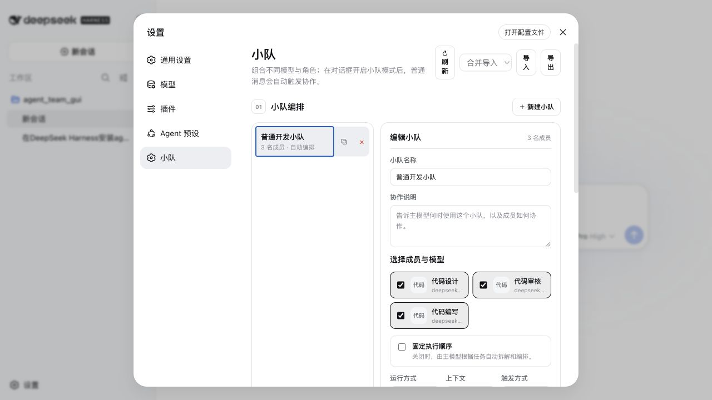
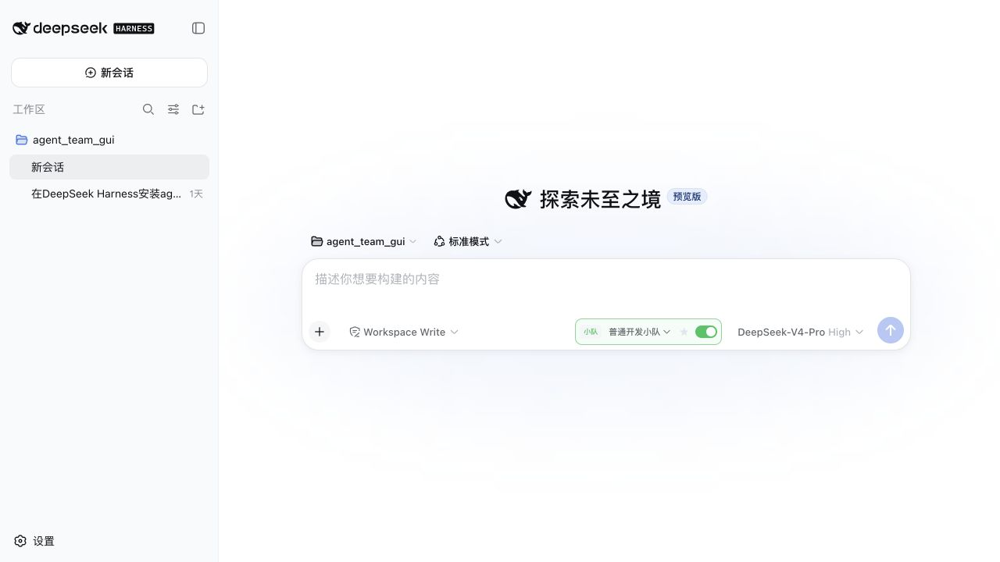
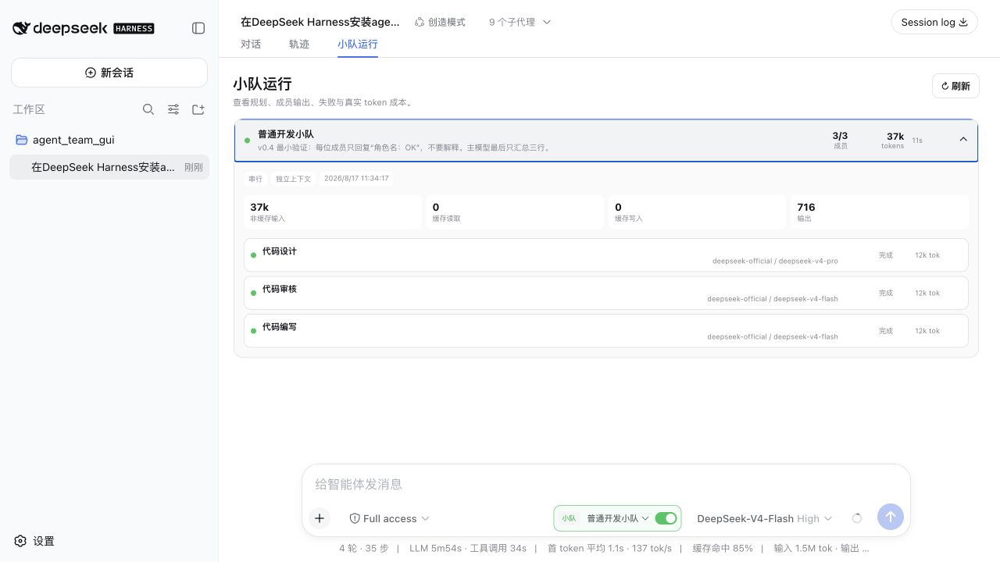

# dsh-agent-team-gui

[English](README.md) | [简体中文](README-zh.md)

[](https://github.com/toolclub/dsh-agent-team-gui/stargazers)
[](https://github.com/toolclub/dsh-agent-team-gui/releases)
[](LICENSE)

**为 [DeepSeek Harness](https://github.com/deepseek-ai/deepseek-harness) 提供持久化的多模型 Agent 小队。**
每个成员可独立配置模型和工具策略；在 Settings 中保存可复用小队，然后在对话输入框旁选择小队，
像平时一样发送消息即可协作。



## 60 秒安装

```sh
dsh plugin --profile web add -w github:toolclub/dsh-agent-team-gui#v0.4.0
dsh --profile web
```

随后打开 **Settings → 小队** 创建小队，在对话输入框旁选择它并开启**小队模式**。插件直接复用
dsh 已配置的模型路由和凭据存储，绝不会保存 API key。

| 你会得到什么 | 为什么有用 |
| --- | --- |
| 每个 Agent 独立的 provider/model 与工具策略 | 一个小队可组合强规划、快实现和严审核模型 |
| 全局持久化的 Agent 与小队 | 建一次队伍，即可跨项目、跨对话复用 |
| 固定顺序或模型规划顺序 | 固化可重复流程，或让主模型针对每次任务安排角色 |
| 串行/并行执行与 spawn/fork/chain 上下文 | 按任务选择协作拓扑，不被单一模式限制 |
| 实时运行中心与官方 token 用量 | 查看规划、输出、重试、失败，以及每个成员由 provider 上报的真实 token |





如果它确实解决了你的工作流，点一个 [GitHub Star](https://github.com/toolclub/dsh-agent-team-gui)
能帮助更多 DeepSeek Harness 用户发现它；也欢迎提交真实小队配方和问题反馈。

> [!WARNING]
> dsh 与本插件目前都是 developer preview。本插件面向 dsh `>=0.1.0-rc.5 <0.2.0`，并要求
> Node.js 22.19 或更高版本。dsh 在稳定版之前可能有破坏性变更；需要可复现时请同时锁定 dsh
> 与本插件版本。

## 核心差异

小队不必共享同一个模型配置。每个 Agent 都能独立选择 dsh 中已有的 provider/model 路由、
`maxTokens` 和工具 allow/deny 策略；这些 Agent 在 Settings 中保存为全局可复用定义，再组合为持久
小队。每个对话可选择一个小队并开启协作；开启后，普通的“发送”就进入协作流程。小队可固定成员
顺序；未固定时，由模型根据任务规划分工与执行顺序。

## 状态与架构

```text
Settings --> 全局 Agent/小队定义 ---------+
对话 ------> 按 session 保存的小队模式 ----+--> dsh storage-domain --> JSON 后端
                                           |
对话小队选择器 + 协作 toggle
                                           |
普通发送 --> 已设置固定成员顺序 -----------+
        `-> 未设置顺序时由模型规划分工/顺序
                                           |
                 Agent A / Agent B / Agent C
                                           |
              assistant 回复 + 可追溯子会话

自然语言要求 --> dispatch_to_squad（模型工具）--> 同一小队 runtime
```

本包包含 Web client、仅 loopback 可用的 Connection RPC、宿主服务、持久化注册表和模型派单工具。
**Settings → 小队**管理全局定义。每个对话都有小队选择器与协作开关；选中小队并开启
协作后，用户仍使用普通输入框发送，不需要单独的派单表单。provider/model 选项来自 dsh 已有的
模型配置。

当前能力：

- 通过 dsh `storage-domain` 持久化 Agent、小队、不可变版本、运行历史、逐 session 选择与项目默认。
- Settings 提供 CRUD、快速模板、安全的合并/替换导入预览、复制、版本恢复和模型路由检查。
- 每个对话独立选择小队并显式开关。默认的**可靠自动运行**会在主模型回答前由 Host 边界执行
  小队，不再依赖模型自行决定是否调用工具；仍保留兼容的“模型按需调用”模式。
- 小队可固定成员顺序；未固定时可指定规划队长，为每次请求生成完整分工与顺序，规划无效时安全
  回退到已配置顺序。
- 每个 Agent 独立的主/回退 `{ provider, model, maxTokens? }` 路由与可视化工具权限；不存 API key。
- 模型可调用 `dispatch_to_squad`，可选显式指定每个 Agent 的任务。
- 支持串行/有界并行、`spawn`/`fork`/串行专用 `chain`，以及成员超时、继续/停止/重试一次、
  回退路由、取消运行与 token 软预算。
- 每个对话新增**小队运行**视图与输入框实时进度条，展示计划、成员进度、输出、重试、耗时、
  child ID 和 dsh 官方 `tokenUsage` 分桶。Harness 暂无稳定价格表，因此不会伪造货币金额。

## 前置条件

- 版本为 `>=0.1.0-rc.5 <0.2.0` 的 dsh **Web profile**。本组合包不支持 headless 或裸 profile。
- Node.js 22.19 或更高版本。
- `PATH` 中有 pnpm。下文 Git 安装说明中的限制适用于 pnpm 10 及更高版本。
- dsh 中已经配置至少一个 provider/model 路由。请通过 dsh Settings 或其凭据机制配置凭据，
  不要把凭据写入本插件记录。

下列命令假设使用已安装的 `dsh` 可执行文件。仅克隆 DeepSeek Harness 源码**不会**自动全局安装
该命令。在 Harness 仓库根目录先这样验证源码 CLI：

```sh
pnpm dsh --version
```

从其他目录运行时，把下文每条 `dsh ...` 替换为
`pnpm --dir /absolute/path/to/deepseek-harness dsh ...`。

## 从本地目录安装

在包含 `dsh-agent-team-gui` 的目录中逐条执行。

1. 安装插件开发依赖：

   ```sh
   pnpm --dir ./dsh-agent-team-gui install
   ```

   预期：pnpm 成功结束，并创建或更新 `dsh-agent-team-gui/node_modules`。

2. 链接进 profile 前构建 checkout：

   ```sh
   pnpm --dir ./dsh-agent-team-gui run build
   ```

   预期：命令以状态 0 退出，并在 `dsh-agent-team-gui/lib/` 下生成运行时入口。

3. 把本地组合包加入 Web profile：

   ```sh
   dsh plugin --profile web add -w ./dsh-agent-team-gui
   ```

   预期：pnpm 报告已加入 `dsh-agent-team-gui`；dsh 不应打印包“declares no dsh.bundle”的警告。

4. 不启动应用，检查组合后的配置：

   ```sh
   dsh --profile web --dump-config
   ```

   预期：输出包含 `dsh-agent-team-gui` 组合包层与 `agent-team-gui` 行。

5. 启动 profile：

   ```sh
   dsh --profile web
   ```

   预期：dsh 正常启动，**Settings → 小队**可用，并且对话中出现小队选择器与协作开关。
   若启用了宿主 info 级日志，日志还会包含
   `[agent-team-gui] v0.4 registry, guaranteed conversation dispatch, run center and token usage ready`。

## 从 tarball 安装

已构建的 tarball 包含编译产物，因此不需要安装脚本授权。

1. 安装依赖并构建：

   ```sh
   pnpm --dir ./dsh-agent-team-gui install
   pnpm --dir ./dsh-agent-team-gui run build
   ```

   预期：两条命令均以状态 0 退出，且 `dsh-agent-team-gui/lib/` 存在。

2. 生成 tarball：

   ```sh
   pnpm --dir ./dsh-agent-team-gui pack
   ```

   预期：pnpm 打印生成的归档文件名，通常是 `dsh-agent-team-gui-0.4.0.tgz`。下一步请使用你的
   pnpm 版本实际打印的完整路径。

3. 安装该归档：

   ```sh
   dsh plugin --profile web add -w ./dsh-agent-team-gui/dsh-agent-team-gui-0.4.0.tgz
   ```

   预期：pnpm 报告已加入 `dsh-agent-team-gui`，且没有 `allowBuilds` 提示。若 `pack` 把归档写到
   其他位置，请替换成实际路径。

4. 验证组合包层：

   ```sh
   dsh --profile web --dump-config
   ```

   预期：dump 中包含 `dsh-agent-team-gui` 层与 `agent-team-gui` 行。

5. 重启仍在运行的 dsh Web 进程，然后刷新浏览器。安装或更新只会替换磁盘文件，无法替换进程中
   已加载的 Host 模块。UI 会执行 RPC 版本握手；若 Client 与 Host 版本不一致，会明确提示重启，
   不再只显示无法解释的感叹号。

## 从 GitHub 安装

Git 依赖只包含源码，而不是预构建的发布产物。因此本仓库提供自包含的 `prepare` 路径来构建运行时
入口，不依赖相邻的 dsh monorepo checkout。

你也可以直接对拥有终端权限的 DeepSeek Harness Agent 发送下面这一句话：

> 根据 https://github.com/toolclub/dsh-agent-team-gui 仓库的 README，把插件安装到 DeepSeek Harness
> 的 web profile；解析 main 当前 commit 并锁定该 SHA，按 README 配置 pnpm `allowBuilds`，最后用
> `dsh --profile web --dump-config` 验证安装。

1. 锁定并安装已经审查的 commit：

   ```sh
   dsh plugin --profile web add -w github:toolclub/dsh-agent-team-gui#<commit-sha>
   ```

   pnpm 10 及以上版本首次执行时的预期：安装可能失败，因为 pnpm 会阻止 Git 依赖的 `prepare`
   脚本。pnpm 会打印**精确的包键**，dsh 会打印需要修改 `pnpm-workspace.yaml` 的 profile 目录。

2. 把 pnpm 打印的键原样加入该 profile 的 workspace 文件。使用默认 dsh home 时，编辑
   `~/.dsh/profiles/web/pnpm-workspace.yaml`；设置了 `DSH_HOME` 时编辑
   `$DSH_HOME/profiles/web/pnpm-workspace.yaml`：

   ```yaml
   allowBuilds:
     dsh-agent-team-gui: true
   ```

   预期：YAML 保留已有 workspace 设置，并在 `allowBuilds` 下包含 pnpm 打印的键。若 pnpm 打印
   了其他键，不要猜测。

3. 重新执行同一条锁定 commit 的安装命令：

   ```sh
   dsh plugin --profile web add -w github:toolclub/dsh-agent-team-gui#<commit-sha>
   ```

   预期：pnpm 获准运行 `prepare`，完成构建并报告包已加入。

4. 验证组合包层：

   ```sh
   dsh --profile web --dump-config
   ```

   预期：dump 中包含 `dsh-agent-team-gui` 层与 `agent-team-gui` 行。

> [!CAUTION]
> `allowBuilds` 表示授权该包在安装时于你的机器上执行代码。这些代码运行在所有 dsh agent 沙箱
> 之外。只放行源码可信的包，审查所选 revision，并用 `github:owner/repo#<sha>` 锁定 commit，
> 防止后续 push 静默改变实际执行内容。使用已构建 tarball 可避免此构建授权。

## 配置

组合包会插入以下宿主行：

```yaml
- id: agent-team-gui
  name: dsh-agent-team-gui
  config:
    defaultProvider: spawn
    defaultExecutionMode: serial
    defaultContextMode: spawn
```

| 字段 | 类型 | 默认值 | 含义 |
|---|---|---|---|
| `defaultProvider` | `string` | `spawn` | 派单/上下文没有选择其他 provider 时使用的已注册 dsh subagent provider。 |
| `defaultExecutionMode` | `serial \| parallel` | `serial` | 默认成员调度方式。 |
| `defaultContextMode` | `spawn \| fork \| chain` | `spawn` | `spawn` 启动无父上下文的新子 Agent；`fork` 包含父会话已完成 turn 的前缀；`chain` 把每个串行成员的文本传给下一位。 |

若要覆盖某个 profile，请编辑 `$DSH_HOME/profiles/<name>/cordis.patch.yml`：

```yaml
- id: agent-team-gui
  config:
    defaultProvider: fork
    defaultExecutionMode: parallel
    defaultContextMode: fork
```

dsh patch 行会整体替换 `config`，不会深合并。覆盖该行时请重写所有需要的字段。`chain` 只能与
串行执行搭配。

Agent 记录字段：

| 字段 | 必填 | 含义 |
|---|---|---|
| `name` | 是 | 显示名称。 |
| `systemPrompt` | 是 | 传给子 Agent 的角色/persona。 |
| `provider` | 是 | 已存在的 dsh provider 路由名。 |
| `model` | 是 | 该 provider 下已有的 model id。 |
| `maxTokens` | 否 | 单 Agent token 上限。 |
| `toolScope.allow` / `toolScope.deny` | 否 | 应用于该子 Agent 的 dsh 工具名限制。 |

小队记录字段：

| 字段 | 必填 | 含义 |
|---|---|---|
| `name` | 是 | Settings 与对话选择器使用的全局显示名称。 |
| `members` | 是 | 小队可用且不重复的 Agent ID。 |
| `collabNote` | 否 | 加入成员 prompt 的协作说明。 |
| `executionOrder` | 否 | 包含全部成员的固定完整顺序；省略时由主模型规划。 |
| `executionMode` | 否 | 小队默认值：`serial` 或 `parallel`；省略时回退到插件配置。 |
| `contextMode` | 否 | 小队默认值：`spawn`、`fork` 或串行专用 `chain`；省略时回退到插件配置。 |

小队记录包含 `name`、可选协作说明、成员列表、可选 `executionOrder`，以及可选的
`executionMode`/`contextMode` 默认值。一个 Agent 可以属于多个小队。**Settings → 小队**通过仅
loopback 可用的宿主 RPC 编辑这些全局记录。固定的 `executionOrder` 必须恰好包含所有成员且不重复；
未固定时，主模型规划分工，并在派单时给出完整 `memberOrder`。插件只保存路由名称，不保存或复制
provider 密钥。

### 同进程 Service API

插件作者也可以在同进程直接使用该注册表：

```ts
const agentId = await ctx.agentTeamGui.createAgent({
  name: 'Reviewer',
  systemPrompt: 'Review for correctness and cite concrete evidence.',
  provider: 'your-configured-provider',
  model: 'your-configured-model',
  toolScope: { allow: ['bash', 'str_replace_editor'] },
})

const squad = await ctx.agentTeamGui.createSquad({
  name: 'Release review',
  collabNote: 'Run independent checks, then consolidate findings.',
  members: [agentId],
})
```

Service 还提供两类记录的 get/list/update/delete 方法、`addMemberToSquad`、
`removeMemberFromSquad`、`exportDefinitions`/`importDefinitions` 与可编程 `dispatch` 方法。准确
TypeScript 签名以包导出的声明文件为准。

## 使用示例

### 自然语言派单（已有小队后可用）

```text
用户：把这个任务交给发布审查小队：检查补丁是否引入回归。
      让 reviewer 查正确性，test agent 并行运行重点测试。

助手：[调用 dispatch_to_squad，传入 squadId、task、
      assignments=[...]、executionMode="parallel"、contextMode="spawn"]

助手：小队返回了两个成员结果。Reviewer 发现……，重点测试……。
      任何失败成员都会被明确列出，而不会被省略。
```

由模型选择是否调用 `dispatch_to_squad`；本插件不会用正则解析用户文本。`squadId` 可以是持久化
ID，也可以是小队准确名称（不区分大小写）；若名称重复，必须使用持久化 ID。工具参数为
`squadId`、`task`，以及可选的 `assignments: [{ agentId, task }]`、`executionMode` 和
`contextMode`。
当小队没有固定 `executionOrder` 时，还可传 `memberOrder`；一旦传入，它必须完整、无重复地排列
所有成员。小队已有固定顺序时，单次调用不能覆盖它。工具会把完整 canonical JSON 结果渲染为文本，
其中包含每个成员的 `runId`、`childId`、状态、错误、stop reason 和输出，供主模型生成最终汇总。

### 对话协作开关

1. 启动 `dsh --profile web`，打开 **Settings → 小队**。
2. 创建 Agent，从 dsh 已配置路由中选择主模型与可选回退模型；可设置 max tokens 与可视化工具
   权限。也可以从开发、审查、产品三个模板快速开始。
3. 创建全局小队、勾选成员并可选固定成员顺序。未固定时可指定规划队长，为每次请求生成分工和
   顺序；还可配置串/并行上下文、重试/停止、超时、并发数与 token 软预算。
4. 打开任意对话，在小队选择器中选择**发布审查小队**，并开启小队协作。
5. 在普通输入框填写任务后点击**发送**。关闭开关后，该对话恢复普通单 Agent 发送。

```text
用户输入：检查这次修改并给出发布建议。
对话控制：发布审查小队 -> 开启协作
用户选择：发送

助手：[选中的小队以当前对话为 parent 开始协作]
助手：发布审查小队建议…… Reviewer：…… Test agent：……
```

小队选择属于当前对话且会持久化。选择器旁的星标可将它设为同一项目目录的新对话默认值，单个
对话仍可显式关闭。全局定义、模式、版本与运行历史都会在重启后保留；删除小队会清理关联的
session 与项目默认。发送时无需第二个任务框或“派单”按钮。默认的可靠模式会在 dsh 官方
`agent/pre-step` waterfall 中由 Host 先运行小队，把 canonical 结果加入上下文，再由主模型生成正常
assistant 回复。即使编排本身失败，主模型也不会被卡死，而会收到清晰失败提示后继续回答。

### 定义导出/导入

**Settings → 小队**可以把全部持久化定义导出/恢复为一个 JSON 文档。

- **导出**下载 `agent-team-gui-<日期>.json`，内容为 `{ "format": "agent-team-gui/definitions",
  "version": 1, "agents": [...], "squads": [...] }`——每条记录携带持久化 id 与模型路由（绝不包含
  API key）。
- **导入**会先预览成员/小队数量，并让用户选择 **merge** 或 **replace**。merge 中的行按 id
  upsert；文档未提及但已存在的行会保留；小队可以引用存储中已有的 agent。整个文档先做完整校验（结构、重复 id、模型路由、小队
  成员引用），因此被拒绝的导入不会写入任何数据。（持久化写入本身不是单一事务：中途存储失败可能
  留下部分应用的结果。）

进程内同样可用 `exportDefinitions()` 与 `importDefinitions(document, mode)`；`mode` 为 `merge`
（默认）或 `replace`。`replace` 让文档成为整个存储，此时小队只能引用文档内的 agent。

## 可观测性与失败行为

每次执行都会在规划前创建持久运行记录。**小队运行**页面展示计划、实时成员状态、完整文本输出、
尝试次数、错误、耗时和 provider 拥有的 child/run ID；活动运行可以取消。Token 数据直接复用 dsh
官方 `tokenUsage` session projection，分别保留非缓存输入、缓存读取、缓存写入与输出。Harness 当前
没有稳定的 provider 价格表，所以插件只报告真实 token，不伪造金额。模型工具路径仍会把完整
canonical JSON 保存在标准持久化 `tool/result` 文本中。宿主日志记录成员生命周期；Cordis 负责
监听器/工具清理，插件卸载时关闭 storage domain。

## 卸载

通用形式是 `dsh plugin --profile <name> remove <pkg>`。本 Web 组合包执行：

```sh
dsh plugin --profile web remove dsh-agent-team-gui
```

预期：pnpm 移除依赖，dsh 从 profile 的组合包列表中移除 `dsh-agent-team-gui`。dsh 存储后端中的
持久化记录不会自动删除。

## 已知限制

- 仅支持 Web profile；本组合包依赖 dsh Web 的 storage、Connection RPC 与 browser module 服务，
  不支持 headless 或裸自定义 profile。
- 没有独立的 shell CLI/YAML 记录编辑器；请使用 Settings 或同进程 Service API。
- 尚无自定义 `squad/*` 会话事件类型：当前树外插件 API 无法把它们注册到 dsh known-event catalog。
  可观测性依赖标准工具事件、子会话和宿主日志。
- storage domain 版本为 0；v0.4 以兼容方式新增表，但未来 developer-preview 版本仍可能需要迁移。
- 保存/导入时会验证模型路由，也可在 Settings 重新检查；之后被删除的路由会形成明确成员失败，
  retry-once 可使用该成员回退路由。
- 默认的可靠模式由 Host 驱动；可选的“模型按需调用”仍是 best-effort，因为 Harness 没有
  `toolChoice` 控制。
- token 预算是软边界：不能在精确 token 点中止已运行成员，但会阻止后续成员/批次启动。
- 在 Harness 提供稳定的 provider 价格接口前，只显示 token 成本，不显示货币金额。
- dsh API 尚未稳定，因此兼容范围有意限定为 `>=0.1.0-rc.5 <0.2.0`。

## Roadmap

- 上游存储契约稳定后增加正式 schema migration。
- Harness 发布统一价格接口后，可选接入 provider 价格适配器。
- 可分享的社区模板包与项目级运行聚合分析。

## 贡献指南

简明教程[《从零开发一个 DeepSeek Harness 插件》](docs/developing-a-deepseek-harness-plugin.zh-CN.md)
介绍 `apply`、类 Service 插件、profile/bundle 接线、本地验证和 GitHub 安装，并引用官方 Harness
文档。版本详情见 [Changelog](CHANGELOG.md)。

1. 创建 issue，说明行为与 dsh 版本。
2. 用 `pnpm install` 安装依赖，用 `pnpm run build` 构建。
3. 添加针对性测试，并按适用范围运行 `pnpm test`、`pnpm run typecheck` 和 `pnpm pack`。
4. 保持 RPC 仅限 loopback；绝不存储 API key；只使用在匹配源码版本中确认过的 dsh API。
5. 提交范围集中的 pull request，commit message 使用英文。

## 许可证

本项目按 [MIT License](LICENSE) 发布。
