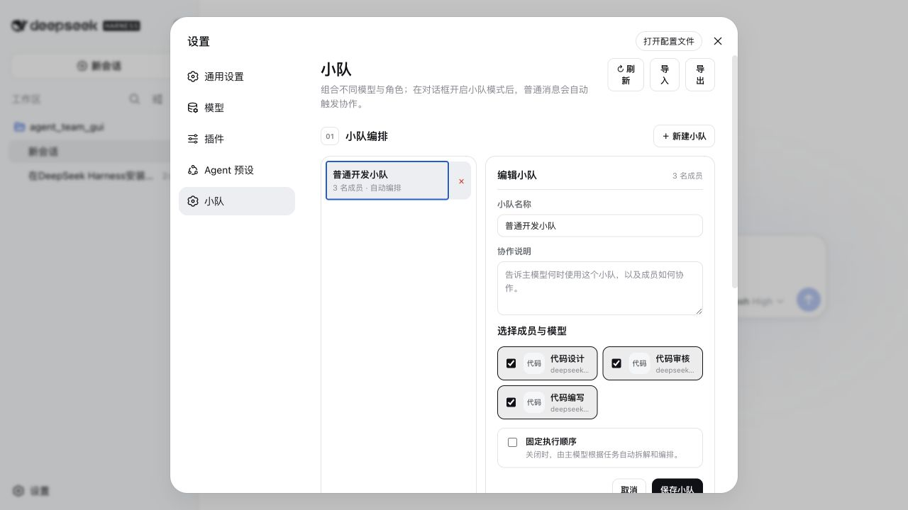
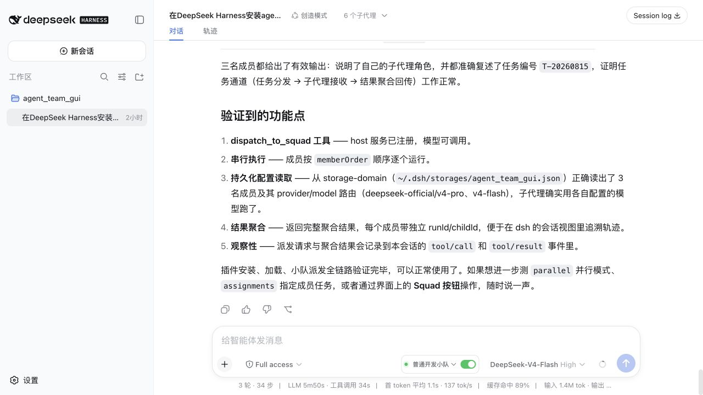

# dsh-agent-team-gui

[English](README.md) | [简体中文](README-zh.md)

[](https://github.com/toolclub/dsh-agent-team-gui/stargazers)
[](https://github.com/toolclub/dsh-agent-team-gui/releases)
[](LICENSE)

**Persistent multi-model agent squads for [DeepSeek Harness](https://github.com/deepseek-ai/deepseek-harness).**
Give every member its own model and tool policy, save reusable teams in Settings, then select a
squad beside the composer and keep chatting normally.



## 60-second install

```sh
dsh plugin --profile web add -w github:toolclub/dsh-agent-team-gui#v0.1.0
dsh --profile web
```

Then open **Settings → Teams**, create a squad, select it beside the conversation composer, and
turn on **Squad mode**. The plugin uses your existing dsh model routes and credential store; it
never stores API keys.

| What you get | Why it matters |
| --- | --- |
| One provider/model and tool policy per agent | Mix a strong planner, fast implementer, and strict reviewer in one squad |
| Global persistent agents and squads | Build a team once, then reuse it across projects and conversations |
| Fixed or model-planned execution order | Pin a repeatable workflow, or let the lead model plan roles for each task |
| Serial/parallel execution with spawn/fork/chain context | Match collaboration topology to the task instead of forcing one pattern |
| Parent tool trace plus child sessions | Inspect which member did what and diagnose failures |



If this workflow is useful, a [GitHub Star](https://github.com/toolclub/dsh-agent-team-gui) helps
other DeepSeek Harness users discover it. Bug reports and real squad recipes are equally welcome.

> [!WARNING]
> Both dsh and this plugin are developer previews. The plugin targets dsh `>=0.1.0-rc.5 <0.2.0`
> and requires Node.js 22.19 or later. dsh can make breaking changes before a stable release; pin
> both dsh and this plugin when reproducibility matters.

## Key distinction

A squad does not have to share one model configuration. Every agent can independently select an
existing dsh provider/model route, `maxTokens`, and tool allow/deny policy. Save those agents as
global reusable definitions in Settings, combine them into persistent squads, and select a squad
per conversation. When squad collaboration is enabled, an ordinary Send enters the collaboration
flow: the squad follows its optional fixed member order, or lets the model plan assignments and
execution order when no order is pinned.

## Status and architecture

```text
Settings --> global agent/squad definitions --+
Conversation --> per-session squad mode -------+--> dsh storage-domain --> JSON backend
                                              |
Conversation squad selector + collaboration toggle
                                              |
ordinary Send --> fixed member order, if set --+
              `-> model-planned roles/order otherwise
                                              |
                  Agent A / Agent B / Agent C
                                              |
             assistant response + traceable child sessions

Natural-language request --> dispatch_to_squad (model tool) --> same squad runtime
```

The package contains a Web client, loopback-only Connection RPC, host service, durable registry,
and model-facing dispatch tool. **Settings → Teams** manages global definitions. Each
conversation gets a squad selector and collaboration toggle; after selecting a squad and enabling
collaboration, the user sends through the ordinary composer rather than a separate dispatch form.
Provider and model choices are read from dsh's existing model configuration.

Current capabilities:

- Durable agent/squad records and per-session squad-mode selection through dsh `storage-domain`.
- Settings forms to create, edit, and delete global agents and squads, including a configured-model
  picker.
- Per-conversation squad selection and an explicit collaboration toggle; when enabled, ordinary
  Send activates the selected squad mode and instructs the lead model to collaborate, while
  disabling it returns to normal single-agent sends.
- Optional fixed member order on a squad; without one, the model determines member assignments and
  execution order from the request.
- Per-agent `{ provider, model, maxTokens? }` route and tool restrictions; no API-key storage.
- Model-callable `dispatch_to_squad` with optional explicit per-agent assignments.
- Serial or parallel execution and `spawn`, `fork`, or serial-only `chain` context modes.
- Explicit per-member success/failure results. One member failure does not silently cancel the
  remaining squad.
- Complete dispatch input/output in the parent session's append-only `tool/call` and `tool/result`
  records, with child session/run IDs in each member result.

## Prerequisites

- The dsh **Web profile**, version `>=0.1.0-rc.5 <0.2.0`. This bundle is not a headless
  or bare-profile bundle.
- Node.js 22.19 or later.
- pnpm on `PATH`. The Git-install notes below apply to pnpm 10 and later.
- At least one provider/model route configured in dsh. Configure credentials through dsh Settings
  or its credentials mechanism, never in this plugin's records.

The commands below assume an installed `dsh` executable. Cloning the DeepSeek Harness source does
**not** install that executable globally. From the Harness repository root, verify the source CLI
with:

```sh
pnpm dsh --version
```

When running from another directory, replace every `dsh ...` below with
`pnpm --dir /absolute/path/to/deepseek-harness dsh ...`.

## Install from a local directory

Run each command from the directory that contains `dsh-agent-team-gui`.

1. Install the plugin's development dependencies:

   ```sh
   pnpm --dir ./dsh-agent-team-gui install
   ```

   Expected: pnpm finishes successfully and creates or updates `dsh-agent-team-gui/node_modules`.

2. Build the checkout before linking it into a profile:

   ```sh
   pnpm --dir ./dsh-agent-team-gui run build
   ```

   Expected: the command exits with status 0 and produces the runtime entry under
   `dsh-agent-team-gui/lib/`.

3. Add the local bundle to the Web profile:

   ```sh
   dsh plugin --profile web add -w ./dsh-agent-team-gui
   ```

   Expected: pnpm reports `dsh-agent-team-gui` as added. dsh must not print the warning that the
   package "declares no dsh.bundle".

4. Inspect the composed configuration without booting it:

   ```sh
   dsh --profile web --dump-config
   ```

   Expected: output contains a `dsh-agent-team-gui` bundle layer and an `agent-team-gui` row.

5. Start the profile:

   ```sh
   dsh --profile web
   ```

   Expected: dsh starts normally, **Settings → Teams** is available, and conversations show
   the squad selector and collaboration toggle. When info-level host logging is enabled, the log
   also contains
   `[agent-team-gui] durable registry and dispatch_to_squad ready`.

## Install from a tarball

A built tarball contains compiled output and therefore needs no install-script allowance.

1. Install dependencies and build:

   ```sh
   pnpm --dir ./dsh-agent-team-gui install
   pnpm --dir ./dsh-agent-team-gui run build
   ```

   Expected: both commands exit with status 0 and `dsh-agent-team-gui/lib/` exists.

2. Create the tarball:

   ```sh
   pnpm --dir ./dsh-agent-team-gui pack
   ```

   Expected: pnpm prints the generated archive name, normally
   `dsh-agent-team-gui-0.1.0.tgz`. Use the exact path printed by your pnpm version below.

3. Install that archive:

   ```sh
   dsh plugin --profile web add -w ./dsh-agent-team-gui/dsh-agent-team-gui-0.1.0.tgz
   ```

   Expected: pnpm reports `dsh-agent-team-gui` as added without an `allowBuilds` prompt. If `pack`
   printed the archive elsewhere, substitute that exact path.

4. Verify the layer:

   ```sh
   dsh --profile web --dump-config
   ```

   Expected: the dump contains the `dsh-agent-team-gui` layer and `agent-team-gui` row.

## Install from GitHub

Git dependencies contain source rather than prebuilt release artifacts. This repository therefore
ships a self-contained `prepare` path that builds its runtime entry without assuming a sibling dsh
monorepo checkout.

You can also send this single sentence to a DeepSeek Harness agent that has terminal access:

> Follow the README at https://github.com/toolclub/dsh-agent-team-gui and install the plugin into the
> DeepSeek Harness web profile; resolve and pin the current main commit SHA, configure pnpm
> `allowBuilds` as documented, and verify with `dsh --profile web --dump-config`.

1. Pin and install a reviewed commit:

   ```sh
   dsh plugin --profile web add -w github:toolclub/dsh-agent-team-gui#<commit-sha>
   ```

   Expected with pnpm 10 or later on the first attempt: installation may fail because pnpm blocks
   the Git dependency's `prepare` script. pnpm prints the **exact package key**, and dsh prints the
   profile directory whose `pnpm-workspace.yaml` must be changed.

2. Add exactly the key pnpm printed to that profile's workspace file. With the default dsh home,
   edit `~/.dsh/profiles/web/pnpm-workspace.yaml` (or
   `$DSH_HOME/profiles/web/pnpm-workspace.yaml` when `DSH_HOME` is set):

   ```yaml
   allowBuilds:
     dsh-agent-team-gui: true
   ```

   Expected: the YAML now preserves any existing workspace settings and contains the printed key
   under `allowBuilds`. Do not guess the key if pnpm printed a different one.

3. Re-run the same pinned install:

   ```sh
   dsh plugin --profile web add -w github:toolclub/dsh-agent-team-gui#<commit-sha>
   ```

   Expected: pnpm is allowed to run `prepare`, builds the package, and reports it as added.

4. Verify the bundle layer:

   ```sh
   dsh --profile web --dump-config
   ```

   Expected: the dump contains the `dsh-agent-team-gui` layer and `agent-team-gui` row.

5. Restart any running dsh Web process, then refresh the browser. Installing or updating replaces
   files on disk but cannot replace an already loaded host module. The UI performs an RPC revision
   handshake and shows an explicit restart message if client and host revisions do not match.

> [!CAUTION]
> `allowBuilds` authorizes that package to execute code on your machine during installation. This
> code runs outside every dsh agent sandbox. Allow only packages whose source you trust, review the
> selected revision, and pin `github:owner/repo#<sha>` so later pushes cannot silently change what
> executes. A built tarball avoids this build permission.

## Configuration

The bundle inserts this host row:

```yaml
- id: agent-team-gui
  name: dsh-agent-team-gui
  config:
    defaultProvider: spawn
    defaultExecutionMode: serial
    defaultContextMode: spawn
```

| Field | Type | Default | Meaning |
|---|---|---|---|
| `defaultProvider` | `string` | `spawn` | Registered dsh subagent provider used unless dispatch/context selection chooses another one. |
| `defaultExecutionMode` | `serial \| parallel` | `serial` | Default member scheduling. |
| `defaultContextMode` | `spawn \| fork \| chain` | `spawn` | `spawn` starts fresh children; `fork` includes the parent's completed-turn prefix; `chain` passes each serial member's text to the next. |

To override it for one profile, edit `$DSH_HOME/profiles/<name>/cordis.patch.yml`:

```yaml
- id: agent-team-gui
  config:
    defaultProvider: fork
    defaultExecutionMode: parallel
    defaultContextMode: fork
```

dsh patch rows replace the complete `config` object; they are not deep-merged. Restate every field
you need whenever overriding the row. `chain` is valid only with serial execution.

Agent records contain:

| Field | Required | Meaning |
|---|---|---|
| `name` | yes | Display name. |
| `systemPrompt` | yes | Role/persona passed to the child agent. |
| `provider` | yes | Existing dsh provider route name. |
| `model` | yes | Existing model id for that provider. |
| `maxTokens` | no | Per-agent token cap. |
| `toolScope.allow` / `toolScope.deny` | no | dsh tool-name restrictions applied to that child. |

Squad records contain:

| Field | Required | Meaning |
|---|---|---|
| `name` | yes | Global display name used by Settings and conversation selectors. |
| `members` | yes | Unique agent IDs available to the squad. |
| `collabNote` | no | Collaboration guidance included in member prompts. |
| `executionOrder` | no | Fixed complete ordering of every member. Omit it for lead-model planning. |
| `executionMode` | no | Squad default: `serial` or `parallel`; falls back to plugin config. |
| `contextMode` | no | Squad default: `spawn`, `fork`, or serial-only `chain`; falls back to plugin config. |

Squad records contain `name`, an optional collaboration note, a member list, optional
`executionOrder`, and optional `executionMode`/`contextMode` defaults. An agent may appear in
multiple squads. **Settings → Teams** edits these global records through a loopback-only host RPC.
A fixed `executionOrder` must contain every member exactly once. With no fixed order, the lead model
plans assignments and passes a complete `memberOrder` when dispatching. The plugin stores route
names only; it does not store or copy provider secrets.

### In-process service API

Plugin authors can also use the same registry in-process:

```ts
const agentId = await ctx.agentTeamGui.createAgent({
  name: 'Reviewer',
  systemPrompt: 'Review for correctness and cite concrete evidence.',
  provider: 'your-configured-provider',
  model: 'your-configured-model',
  toolScope: { allow: ['bash', 'str_replace_editor'] },
})

const squad = await ctx.agentTeamGui.createSquad({
  name: 'Release review',
  collabNote: 'Run independent checks, then consolidate findings.',
  members: [agentId],
})
```

The service also exposes get/list/update/delete methods for both record types,
`addMemberToSquad`, `removeMemberFromSquad`, `exportDefinitions`/`importDefinitions`, and a
programmatic `dispatch` method. Exact TypeScript signatures are exported by the package
declarations.

## Usage examples

### Natural-language dispatch (available after a squad exists)

```text
User: Give the release-review squad this task: inspect the patch for regressions.
      Have the reviewer check correctness and the test agent run focused tests in parallel.

Assistant: [calls dispatch_to_squad with squadId, task,
            assignments=[...], executionMode="parallel", contextMode="spawn"]

Assistant: The squad completed with two member results. The reviewer found ..., and the focused
           tests .... Any failed member is listed explicitly instead of being omitted.
```

The model selects `dispatch_to_squad`; the plugin does not parse the user's text with regular
expressions. `squadId` accepts either the durable ID or an exact squad name (case-insensitive); if
names are duplicated, use the durable ID. Tool arguments are `squadId`, `task`, optional
`assignments: [{ agentId, task }]`, optional `executionMode`, and optional `contextMode`.
`memberOrder` is also optional when the squad has no fixed `executionOrder`; when supplied, it must
be a complete, duplicate-free ordering of all squad members. A fixed squad order cannot be
overridden per call. The tool renders the complete canonical JSON result—including each member's
`runId`, `childId`, status, error, stop reason, and output—so the lead model can produce the final
summary.

### Conversation collaboration toggle

1. Start `dsh --profile web` and open **Settings → Teams**.
2. Create the agents. Choose each provider/model from the routes already configured in dsh;
   optionally enter max tokens and comma-separated allowed/denied tools.
3. Create a global squad, select its members, add an optional collaboration note, and optionally
   pin a fixed member order. Leave the order unset to let the model plan roles and ordering.
4. Open any conversation, select **Release review** in its squad selector, and enable squad
   collaboration.
5. Type the task in the normal composer and select **Send**. Disable the toggle to return that
   conversation to ordinary single-agent sends.

```text
User types: Inspect this change and prepare a release recommendation.
Conversation control: Release review squad -> Collaboration on
User selects: Send

Assistant: [the selected squad collaborates using the current conversation as parent]
Assistant: The release-review squad recommends ... Reviewer: ... Test agent: ...
```

The selected squad is conversation-scoped and its mode is durable; both session modes and global
agent/squad definitions survive restart. Deleting a selected squad automatically disables affected
session modes. Sending does not require a second task box or a separate Dispatch button.
Internally, a dynamic system prompt tells the lead model to call `dispatch_to_squad` once and
summarize its result for the normal assistant response. This is a best-effort model instruction,
not an API-level forced tool call; see Known limitations.

### Export and import definitions

**Settings → Teams** can dump and restore the durable definitions as a JSON document.

- **Export** downloads `agent-team-gui-<date>.json` containing `{ "format":
  "agent-team-gui/definitions", "version": 1, "agents": [...], "squads": [...] }` — every record with
  its durable id, plus model routes (never API keys).
- **Import** reads such a file and applies it with **merge** semantics: document rows are upserted by
  id, rows already in the store that the document does not mention are kept, and a squad may
  reference an agent that already exists in the store. The whole document is validated first — shape,
  duplicate ids, model routes, and squad member references — so a rejected import writes nothing.
  (The durable writes themselves are not a single transaction: a storage failure mid-import can leave
  a partial apply.)

The same operations are available in-process as `exportDefinitions()` and
`importDefinitions(document, mode)`; `mode` is `merge` (default) or `replace`. `replace` makes the
document the entire store, and then a squad may only reference agents present in the document.

## Observability and failure behavior

The parent session's ordinary `tool/call` and durable text `tool/result` events retain the request
and complete canonical JSON aggregate. Every member result includes the provider-owned child
session/run IDs when a
child started, so its trajectory can be inspected through dsh's existing subagent/session views.
The host log also records member start/finish/failure. Results distinguish complete, partial, and
failed members. A member failure is aggregated with its error and does not silently stop unrelated
members. The plugin contributes no long-lived subprocess; Cordis owns tool/listener cleanup, and
the storage domain is closed when the plugin unloads.

## Uninstall

The general form is `dsh plugin --profile <name> remove <pkg>`. For this Web bundle:

```sh
dsh plugin --profile web remove dsh-agent-team-gui
```

Expected: pnpm removes the dependency and dsh removes `dsh-agent-team-gui` from the profile's bundle
list. Durable records under the dsh storage backend are not automatically deleted.

## Known limitations

- Web profile only; the bundle depends on dsh Web's storage, Connection RPC, and browser module
  services and does not support a headless or bare custom profile.
- There is no separate shell CLI/YAML record editor; use Settings or the in-process service API.
- No custom `squad/*` session event types: the current out-of-tree API cannot register them in
  dsh's known-event catalog. Observability relies on standard tool events, child sessions, and host
  logs.
- The storage domain is version 0; developer-preview releases may reject or require migration of
  older on-disk data.
- Model route names are validated by dsh when children run; a removed/misspelled provider or model
  produces an explicit member failure.
- Squad mode is best-effort model orchestration: the dynamic system prompt instructs exactly one
  `dispatch_to_squad` call, but the current Harness generation API exposes no `toolChoice` control
  with which the plugin could hard-force that call.
- Large fan-outs do not yet use the workflow engine's concurrency controls.
- dsh APIs are pre-stable, so compatibility is intentionally bounded to `>=0.1.0-rc.5 <0.2.0`.

## Roadmap

- Add bulk editing and richer per-agent assignment controls in Settings.
- Add schema migrations for durable definitions.
- Add bounded concurrency and richer trajectory projections for large squads.

## Contributing

1. Open an issue describing the behavior and dsh version.
2. Install dependencies with `pnpm install` and build with `pnpm run build`.
3. Add focused tests and run `pnpm test`, `pnpm run typecheck`, and `pnpm pack` as applicable.
4. Keep RPC loopback-scoped, never store API keys, and use only dsh APIs verified in the matching
   source version.
5. Submit a focused pull request with an English commit message.

## License

Released under the [MIT License](LICENSE).
